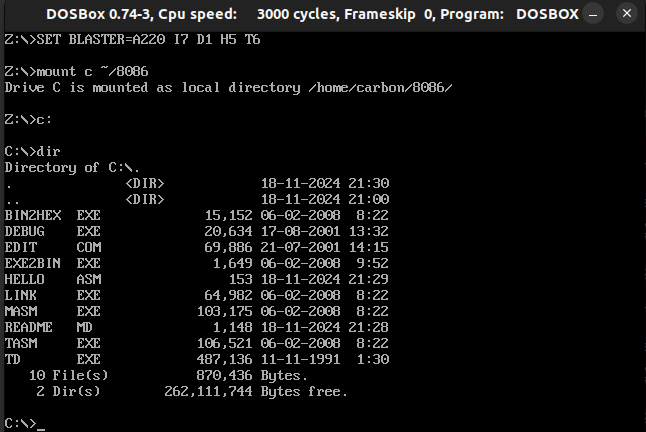

### Getting Started 
These are instruction for installing and running `DOSBox + MASM` in debian/ubuntu
for other platforms you can visit: [DOSBox](https://www.dosbox.com/download.php?main=1)

For a dosbox manual visit: [DOSBox Manual](https://www.dosbox.com/DOSBoxManual.html)
Install dosbox

```
$ sudo apt install dosbox
```


Download masm compiler: 
```
https://www.mediafire.com/file/mm7cjztce9efj4w/8086.zip
```

Copy and extract masm files to home: `~/8086`

Once extracted, 8086 directory should have all the masm executables


Launch Dosbox 

```
$ dosbox
```

Within dosbox type these commands line by line:


```
mount c ~/8086
c:
```


Now you should be in the virtual c: directory which will 
have the masm compiler files: `MASM.exe, LINK.exe, DEBUG.exe`

To make sure everthing is setup correctly:
- Terminal should change directory symbol to `C:\>`
- Running `dir` command should list the contents of the 8086 compiler files 




### Compiling and Executing 

First create a new file
```
edit hello.asm
```

Compile, Link, Execute
```
masm hello.asm
link hello
hello.exe
```

This should successfully execute the assembly program


